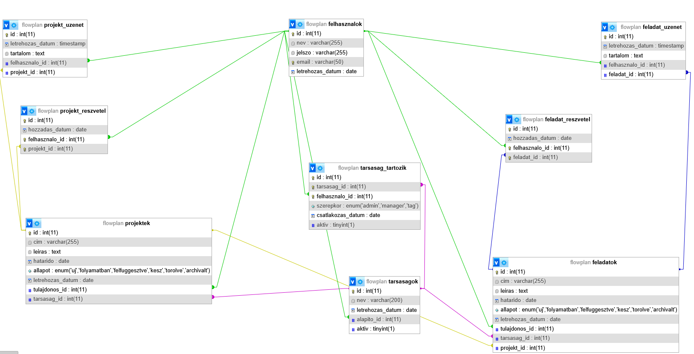

# FlowPlan – Projektkezelő alkalmazás dokumentációja

---

## Tartalomjegyzék

1. [Backend - Felhasználói dokumentáció](#1-felhasználói-dokumentáció)
2. [Backend - Üzemeltetői dokumentáció](#2-üzemeltetői-dokumentáció)
3. [Backend - Fejlesztői dokumentáció](#3-fejlesztői-dokumentáció)
4. [Backend - Tesztelési dokumentáció](#4-tesztelési-dokumentáció)
5. [Frontend](#5-frontend-dokumentáció)
6. [Frontend - Felhasználói dokumentáció](#51-felhasználói-dokumentáció)
7. [Frontend - Üzemeltetői dokumentáció](#52-üzemeltetői-dokumentáció)
8. [Frontend - Fejlesztői dokumentáció](#53-fejlesztői-dokumentáció)
9. [Frontend - Tesztelési dokumentáció](#54-tesztelési-dokumentáció)

---

## 1. Felhasználói dokumentáció

### 1.1 A rendszer célja

A **FlowPlan** egy webalapú projektkezelő alkalmazás, amely lehetővé teszi csapatok számára, hogy társaságokba, projektekbe és feladatokba szervezve kezeljék a munkájukat. A rendszer frontend (React) és backend (Node.js/Express) részből áll, amelyek REST API-n keresztül kommunikálnak egymással.

### 1.2 A rendszer főbb funkciói

**Felhasználókezelés**
- Regisztráció és bejelentkezés JWT token alapú hitelesítéssel
- Profil megtekintése és kezelése

**Társaságok (tarsasagok)**
- Társaság létrehozása, módosítása, törlése, deaktiválás
- Tagok kezelése: hozzáadás, szerepkör-módosítás (admin, manager, tag), eltávolítás

**Projektek (projektek)**
- Projekt létrehozása egy adott társaságon belül
- Projekt adatainak megtekintése és módosítása
- Projekt állapotának követése: `uj`, `folyamatban`, `felfuggesztve`, `kesz`, `torolve`, `archivalt`
- Projekthez résztvevők hozzáadása és eltávolítása
- Projekthez üzenetek írása (komment funkció)
- Projekt törlése (kétlépéses: előbb „töröltre" állítás, majd végleges törlés)
- Projekthez tartozó feladatok böngészése

**Feladatok (feladatok)**
- Feladat létrehozása projekthez kötve
- Feladat adatainak megtekintése és módosítása
- Feladat állapotának követése: `uj`, `folyamatban`, `felfuggesztve`, `kesz`, `torolve`, `archivalt`
- Feladathoz résztvevők hozzáadása és eltávolítása
- Feladathoz üzenetek írása (komment funkció)
- Feladat törlése (kétlépéses: előbb „töröltre" állítás, majd végleges törlés)

### 1.3 Felhasználói szerepkörök

| Szerepkör | Jogosultságok |
|-----------|---------------|
| **admin** | Teljes hozzáférés: Társaság/projekt/feladat létrehozás, módosítás, törlés, tagkezelés |
| **manager** | Projektek/feladatok kezelése, tagok hozzáadása/eltávolítása feladatokhoz/projektekhez |
| **tag** | Feladatok megtekintése, üzenetküldés |

### 1.4 Társaásokon belüli jogosultsági mátrix

| Funkció | Alapító | Admin | Manager | Tag |
|---------|---------|-------|---------|-----|
| Társaság létrehozása | ✅ | ✅ | ✅ | ✅ |
| Társaság törlése | ✅ | ❌ | ❌ | ❌ |
| Társaság név módosítása | ✅ | ✅ | ❌ | ❌ |
| Társaság deaktiválása | ✅ | ❌ | ❌ | ❌ |
| Tag hozzáadása | ✅ | ✅ | ❌ | ❌ |
| Tag szerepkör módosítása | ✅ | ✅ | ✅* | ❌ |
| Tag deaktiválása | ✅ | ✅ | ✅* | ❌ |
| Alapító átruházása | ✅ | ❌ | ❌ | ❌ |

**\* Manager csak Tag szerepkörű felhasználókat módosíthat/deaktiválhat (admin/manager/alapító-t nem)**

### 1.5 API elérése és hitelesítés

### Autentikáció

#### Regisztráció
```http
POST /api/felhasznalok/register
Content-Type: application/json

{
    "nev": "Nagy Péter",
    "email": "peter.nagy@example.com",
    "jelszo": "BiztonságosJelszó123"
}
```

**Válasz:**
```json
{
    "uzenet": "Sikeres regisztráció",
    "felhasznalo_id": 1
}
```

#### Bejelentkezés
```http
POST /api/felhasznalok/login
Content-Type: application/json

{
    "email": "peter.nagy@example.com",
    "jelszo": "BiztonságosJelszó123"
}
```

**Válasz:**
```json
{
    "uzenet": "Sikeres bejelentkezés",
    "accessToken": "eyJhbGciOiJIUzI1NiIs...",
    "refreshToken": "eyJhbGciOiJIUzI1NiIs..."
}
```

#### Token Frissítés
```http
POST /api/felhasznalok/refresh
Content-Type: application/json

{
    "refreshToken": "eyJhbGciOiJIUzI1NiIs..."
}
```

### Társaság Kezelés

#### Új Társaság Létrehozása
```http
POST /api/tarsasagok/company
Authorization: Bearer {accessToken}
Content-Type: application/json

{
    "nev": "TechStartup Kft."
}
```

#### Tagok Listázása
```http
GET /api/tarsasagok/{tarsasag_id}/members
Authorization: Bearer {accessToken}
```

**Válasz:**
```json
{
    "members": [
        {
            "felhasznalo_id": 1,
            "felhasznalo_nev": "Nagy Péter",
            "email": "peter.nagy@example.com",
            "szerepkor": "admin",
            "alapito": "Igen",
            "aktiv": 1
        }
    ],
    "currentUserId": 1
}
```

#### Tag Hozzáadása Email Alapján
```http
POST /api/tarsasagok/{tarsasag_id}/tagok
Authorization: Bearer {accessToken}
Content-Type: application/json

{
    "email": "kovacs.anna@example.com",
    "szerepkor": "manager"
}
```

#### Szerepkör Módosítása
```http
PUT /api/tarsasagok/{tarsasag_id}/tagok/{felhasznaloId}
Authorization: Bearer {accessToken}
Content-Type: application/json

{
    "szerepkor": "admin"
}
```

#### Tag Deaktiválása
```http
PUT /api/tarsasagok/{tarsasag_id}/member/{felhasznaloId}/deactivate
Authorization: Bearer {accessToken}
```

#### Alapító Módosítása
```http
PUT /api/tarsasagok/{tarsasag_id}/alapito
Authorization: Bearer {accessToken}
Content-Type: application/json

{
    "uj_alapito_id": 2
}
```

### Profil Kezelés

#### Profil Megtekintése
```http
GET /api/felhasznalok/profile
Authorization: Bearer {accessToken}
```

#### Profil Módosítása
```http
PUT /api/felhasznalok/profile
Authorization: Bearer {accessToken}
Content-Type: application/json

{
    "nev": "Nagy Péter Jr.",
    "email": "peter.nagy.jr@example.com"
}
```

#### Jelszó Módosítása
```http
PUT /api/felhasznalok/password
Authorization: Bearer {accessToken}
Content-Type: application/json

{
    "regiJelszo": "RegiJelszó123",
    "ujJelszo": "ÚjBiztonságosJelszó456"
}
```

## 1.6 Hibakódok

| Kód | Jelentés | Példa |
|-----|----------|-------|
| 200 | Sikeres művelet | Sikeres adatlekérés |
| 201 | Sikeres létrehozás | Új társaság létrehozva |
| 400 | Hibás kérés | Érvénytelen adatok |
| 401 | Nincs autentikáció | Hiányzó vagy érvénytelen token |
| 403 | Nincs jogosultság | Manager próbál admint módosítani |
| 404 | Nem található | Felhasználó nem létezik |
| 409 | Konfliktus | Email cím már használatban |
| 500 | Szerverhiba | Adatbázis kapcsolat hiba |

### 1.7 Projektek állapotainak életciklusa

```
uj → folyamatban → kesz
         ↓
    felfuggesztve
         ↓
      torolve → (végleges törlés, ha újra törlés kérés érkezik)
         ↓
     archivalt
```

A törlés kétlépéses: az első törlési kérésnél a feladat állapota `torolve` lesz. Ha ezt követően ismét törlési kérés érkezik ugyanarra a feladatra, a rendszer véglegesen eltávolítja azt az adatbázisból.

### 1.8 Feladatok állapotainak életciklusa

```
uj → folyamatban → kesz
         ↓
    felfuggesztve
         ↓
      torolve → (végleges törlés, ha újra törlés kérés érkezik)
         ↓
     archivalt
```

A törlés kétlépéses: az első törlési kérésnél a feladat állapota `torolve` lesz. Ha ezt követően ismét törlési kérés érkezik ugyanarra a feladatra, a rendszer véglegesen eltávolítja azt az adatbázisból.

---

## 2. Üzemeltetői dokumentáció

### 2.1 Rendszerkövetelmények

| Komponens | Minimum verzió |
|-----------|---------------|
| Node.js | v14.x vagy újabb (ajánlott: v18.x) |
| npm | v9.x vagy újabb |
| MySQL | v8.0 vagy újabb |
| Operációs rendszer | Windows 10/11 |

### 2.2 Telepítési útmutató

#### 2.2.1 Node.js Telepítése

- Töltsd le az installert: https://nodejs.org/
- Futtasd a letöltött .msi fájlt

#### 2.2.2 Repository megnyitása

```bash
cd flowplan
```

#### 2.2.3 Függőségek telepítése

A backend könyvtárában futtasd:

```bash
npm install
```

A telepítendő főbb csomagok (`package.json` alapján):

| Csomag | Verzió | Szerepe |
|--------|--------|---------|
| express | ^5.2.1 | HTTP szerver keretrendszer |
| mysql2 | ^3.17.1 | MySQL adatbázis kapcsolat |
| jsonwebtoken | ^9.0.3 | JWT token kezelés |
| bcrypt | ^6.0.0 | Jelszó hash-elés |
| express-validator | ^7.3.1 | Bemeneti adatok validálása |
| dotenv | ^17.3.1 | Környezeti változók kezelése |
| cors | ^2.8.6 | Cross-Origin Resource Sharing |
| swagger-jsdoc | ^6.2.8 | Swagger dokumentáció generálás |
| swagger-ui-express | ^5.0.1 | Swagger UI kiszolgálása |

#### 2.2.4 Környezeti változók beállítása

Hozz létre egy `.env` fájlt a projekt gyökérkönyvtárában az alábbi tartalommal:

```env
HOST = localhost
DB_USERNAME = root
PASSWORD = ''
DATABASE_NAME = flowplan
MULTIPLE_STATEMENTS = true
JWT_SECRET = valami_nagyon_hosszu_random_szoveg
JWT_REFRESH_SECRET = titkos-kulcs
```

> **Fontos:** A `JWT_SECRET` értéke legyen egy hosszú, véletlenszerű karakterlánc. Ne kerüljön verziókezelő rendszerbe (a `.gitignore` fájl gondoskodik erről).

#### 2.2.5 Adatbázis előkészítése (phpMyAdmin használatával)

1. Nyisd meg a phpMyAdmin felületet (pl. http://localhost/phpmyadmin)
2. Válaszd ki a flowplan adatbázist
3. Navigálj az Import fülre
4. Tallózd be a flowplan.sql fájlt a BACKEND/dumps mappából
5. Kattints az Indítás (Go) gombra

#### 2.2.6 Az alkalmazás indítása

```bash
npm start
```

A szerver alapértelmezetten a `http://localhost:3000` címen érhető el.

### 2.3 CORS konfiguráció

A CORS beállítások a `middlewares/cors.js` fájlban találhatók. Alapértelmezetten csak a `http://localhost:5173` (React fejlesztői szerver) felől érkező kérések engedélyezettek. 


### 2.5 API végpontok áttekintése

| Modul | Alap URL |
|-------|----------|
| Felhasználók | `/api/felhasznalok` |
| Társaságok | `/api/tarsasagok` |
| Projektek | `/api/projektek` |
| Feladatok | `/api/feladatok` |
| Dokumentáció | `/api/docs` |

### 2.6 Hibakezelés

A szerver kétszintű hibakezelővel rendelkezik (`middlewares/errorHandler.js`):

- **404 – Not Found:** Ha a kért végpont nem létezik, a rendszer JSON formátumban visszaadja az eredeti URL-t.
- **500 – Server Error:** Adatbázis- vagy szerverhiba esetén aktiválódik. Éles környezetben a `magyarazat` mező eltávolítása javasolt biztonsági okokból.

---

## 3. Fejlesztői dokumentáció

## 3.1 Technológiai Stack

### Backend Framework
- **Node.js** v18.x - JavaScript runtime
- **Express.js** v5.x - Web framework

### Adatbázis
- **MySQL** 8.0 - Relációs adatbáziskezelő

### Biztonsági Eszközök
- **bcrypt** - Jelszó hash-elés (költség faktor: 10)
- **jsonwebtoken (JWT)** - Token-alapú autentikáció
- **express-validator** - Bemeneti validáció
- **helmet** - HTTP header biztonság
- **cors** - Cross-Origin Resource Sharing

### Dokumentáció
- **swagger-jsdoc** - API dokumentáció generálás
- **swagger-ui-express** - Interaktív API dokumentáció UI

### Fejlesztői Eszközök
- **nodemon** - Auto-reload development módban
- **dotenv** - Környezeti változók kezelése

### 3.2 Projektstruktúra

```
BACKEND/
├── controllers/                # Üzleti logika
│   ├── companyControler.js     # Társaság végpontok/műveletek
│   ├── projectControler.js     # Projekt végpontok/műveletek
│   ├── taskControler.js        # Feladat végpontok/műveletek
│   └── userController.js       # Felhasználó végpontok/műveletek
│
├── lib/
│   └── swagger.js              # Swagger/OpenAPI konfiguráció
│
├── middlewares/                # Köztes rétegek
│   ├── auth.js                 # JWT hitelesítés és szerepkör-ellenőrzés
│   ├── cors.js                 # CORS beállítások
│   └── errorHandler.js         # Globális hibakezelők
│
├── models/                     # Adatbázis műveletek
│   ├── companyModel.js         # Társaságok adatbázis lekérdezések 
│   ├── projectModel.js         # Projektek adatbázis lekérdezések
│   ├── taskModel.js            # Feladatok adatbázis lekérdezések
│   └── userModel.js            # Felhasználók adatbázis lekérdezések
│
├── routes/                     # Endpoint definíciók (/api/...)
│   ├── companyRoutes.js        # Társaság útvonalak
│   ├── projectRoutes.js        # Projekt útvonalak
│   ├── swaggerRoutes.js        # Swagger UI útvonal
│   ├── taskRoutes.js           # Feladat útvonalak
│   └── userRoutes.js           # Felhasználó útvonalak
│
├── tests/                      # tesztek
│   ├── companyDelete.test.js   # Társaság törlés tesztelése
│   ├── companyPost.test.js     # Társaság létrehozás tesztelése
│   ├── companyPut.test.js      # Társaság módosítás tesztelése
│   ├── taskDelete.test.js      # Feladat törlés tesztelése
│   ├── taskPost.test.js        # Feladat létrehozás tesztelése
│   ├── taskPut.test.js         # Feladat módosítás tesztelése
│   ├── userDelete.test.js      # Felhasználó törlés tesztelése
│   ├── userPost.test.js        # Felhasználó létrehozás tesztelés
│   └── userPut.js              # Felhasználó módosítás tesztelés
│
├── utils/                      # Segéd függvények
│   ├── error.js                # 405 Method Not Allowed válasz
│   └── validationHelper.js     # Validációs hibák egységes kezelése
│
├── validators/                 # Bemeneti validátorok
│   ├── companyValidators.js    # Társaság validációk
│   ├── projectValidators.js    # Projekt validációk
│   ├── taskValidators.js       # Feladat validációk
│   └── userValidators.js       # Felhasználó validációk
│
├── database.js                 # MySQL kapcsolat konfiguráció
├── package.json                # NPM függőségek
├── server.js                   # Express alkalmazás belépési pontja
└── .env                        # Környezeti változók (nem kerül verziókezelőbe)
```

### 3.3 Alkalmazott technológiák

| Technológia | Szerepe |
|-------------|---------|
| **Node.js** | Szerver oldali JavaScript futtatókörnyezet |
| **Express.js v5** | REST API keretrendszer, útvonalkezelés |
| **MySQL2** | Relációs adatbázis-kapcsolat, callback-alapú lekérdezések |
| **JWT (jsonwebtoken)** | Állapotmentes hitelesítési tokenek |
| **bcrypt** | Jelszavak biztonságos hash-elése és sózása |
| **express-validator** | Deklaratív bemeneti validáció |
| **Swagger (jsdoc + ui)** | Automatikus API dokumentáció generálás JSDoc kommentekből |
| **dotenv** | Konfigurációs adatok elválasztása a kódtól |
| **cors** | Böngészőalapú cross-origin kérések engedélyezése |
| **React** | Frontend keretrendszer (külön repository) |

### 3.4 Autentikáció és Autorizáció

#### 3.4.1 JWT Token Mechanizmus

##### Access Token
- **Élettartam**: 15 perc
- **Cél**: API végpontok hitelesítése
- **Payload**:
```javascript
{
    id: 123,              // Felhasználó ID
    email: "user@example.com",
    iat: 1234567890,      // Issued at
    exp: 1234568790       // Expiration
}
```

##### Refresh Token
- **Élettartam**: 7 nap
- **Cél**: Access token megújítása
- **Tárolás**: HttpOnly cookie (ajánlott) vagy localStorage

#### 3.4.2 Jelszó Hash-elés (bcrypt)

**Implementáció:**
```javascript
const bcrypt = require('bcrypt');
const SALT_ROUNDS = 10;

// Regisztráció során
const hashedPassword = await bcrypt.hash(plainPassword, SALT_ROUNDS);

// Bejelentkezéskor
const isValid = await bcrypt.compare(plainPassword, hashedPassword);
```

**Biztonsági Jellemzők:**
- **Algoritmus**: bcrypt (Blowfish alapú)
- **Salt**: Véletlenszerű, felhasználónként egyedi
- **Költség faktor**: 10 (2^10 = 1024 iteráció)
- **Hash hossz**: 60 karakter

**Példa hash:**
```
$2b$10$N9qo8uLOickgx2ZMRZoMyeIjZAgcfl7p92ldGxad68LJZdL17lhWy
│  │  │                           │
│  │  │                           └─ Hash (31 karakter)
│  │  └───────────────────────────── Salt (22 karakter)
│  └────────────────────────────────── Költség faktor (10)
└───────────────────────────────────── Algoritmus azonosító (2b)
```

#### 3.4.3 Token Refresh Flow

```
┌─────────┐                          ┌─────────┐
│ Client  │                          │ Server  │
└────┬────┘                          └────┬────┘
     │                                    │
     │  POST /api/felhasznalok/login     │
     │ ──────────────────────────────────>│
     │                                    │
     │  ← accessToken (15m)               │
     │  ← refreshToken (7d)               │
     │<───────────────────────────────────│
     │                                    │
     │  GET /api/... (with accessToken)   │
     │ ──────────────────────────────────>│
     │  ← 200 OK vagy 401 Unauthorized    │
     │<───────────────────────────────────│
     │                                    │
     │  POST /api/felhasznalok/refresh    │
     │  { refreshToken }                  │
     │ ──────────────────────────────────>│
     │  ← új accessToken (15m)            │
     │<───────────────────────────────────│
```

#### 3.4.4 Middleware Autentikáció

**verifyToken Middleware:**
```javascript
const jwt = require('jsonwebtoken');

const verifyToken = (req, res, next) => {
    const header = req.headers.authorization;

    if (!header) {
        return res.status(401).json({ 
            uzenet: "Nem található token" 
        });
    }

    const token = header.split(" ")[1]; // "Bearer TOKEN"

    jwt.verify(token, process.env.JWT_SECRET, (err, decoded) => {
        if (err) {
            return res.status(403).json({ 
                uzenet: "Érvénytelen token" 
            });
        }

        req.user = decoded; // { id, email }
        next();
    });
};
```

**Használat Route-okban:**
```javascript
router.get('/profile', verifyToken, userController.getUserProfile);
```

#### 3.4.5 Szerepkör-alapú jogosultság ellenőrzés

A rendszer háromszintű szerepkör-alapú hozzáférés-vezérlést (RBAC) valósít meg:

**`requireTaskRole(elvartSzerepkorok[])`** – Egy adott feladathoz kapcsolódó jogosultság ellenőrzése. Az adatbázisból lekérdezi a bejelentkezett felhasználó szerepkörét a feladat társaságában (JOIN a `feladatok`, `tarsasagok` és `tarsasag_tartozik` táblákon keresztül), majd összeteveti az elvárt szerepkörökkel.

**`requireProjectRole(elvartSzerepkorok[])`** – Projektszintű jogosultság-ellenőrzés, hasonló logikával.

**`requireCompanyRole(elvartSzerepkorok[])`** – Társaságszintű jogosultság-ellenőrzés.

Mindhárom middleware factory function: visszaad egy Express middleware függvényt, ami a konkrét kérésnél fut le. Ez a minta lehetővé teszi, hogy az elvárt szerepkörök paraméterként adhatók meg az útvonal definíciójánál:

```js
router.delete('/:feladat_id/torles',
    taskDeleteValidator,
    authMiddleware.verifyToken,
    authMiddleware.requireTaskRole(['admin', 'manager']),  // csak admin/manager törölhet
    taskController.deleteUserTask
);
```

### 3.5 Adatvalidáció

A validáció az `express-validator` könyvtárra épül, deklaratív, tömbös formában (`taskValidators.js`). Minden útvonalhoz külön validátor tömb tartozik, amelyek URL paramétereket (`param()`) és request body mezőket (`body()`) egyaránt ellenőriznek.

A validáció eredményét a `utils/validationHelper.js` `validateRequest` függvénye dolgozza fel. Ha van hiba, egységes JSON struktúrában adja vissza:

```json
{
  "valasz": "Validációs hiba!",
  "hibak": [
    { "mezo": "cim", "uzenet": "A címnek szövegnek kell lennie és kötelezően megadandó!" }
  ]
}
```

Ez a megközelítés biztosítja, hogy a frontend mindig ugyanolyan struktúrájú hibaválaszt kapjon, és pontosan azonosítani tudja, melyik mező hibás.

### 3.6 Kétlépéses törlés (Soft Delete + Hard Delete)

A `deleteUserTask` kontroller egy egyedi kétlépéses törlési algoritmust valósít meg:

1. **Első törlési kérés:** A rendszer lekérdezi a feladat jelenlegi állapotát. Ha az nem `torolve`, akkor a `softDeleteTask` modell metódust hívja, amely az állapotot `torolve`-ra állítja (`UPDATE`). A felhasználó `200`-as választ kap: `"A feladat a töröltek közé helyezve"`.

2. **Második törlési kérés (ha az állapot már `torolve`):** A `deleteTask` modell metódus fut le, amely ténylegesen törli a sort az adatbázisból (`DELETE`). A válasz: `"Feladat véglegesen törölve"`.

Ez a megközelítés védelmet nyújt a véletlen törlés ellen, és lehetőséget ad a visszaállításra az első törlés után.

### 3.7 Adatbázis réteg (Model)

A `taskModel.js` az adatbázis összes lekérdezését tartalmazza, egyértelműen elkülönítve az üzleti logikától. Minden metódus callback-alapú, a `mysql2` könyvtár konvencióját követve: `(err, data)` paraméterezéssel.

Figyelemre méltó lekérdezések:

**`insertNewTask`** – Kétlépéses `INSERT`: először létrehozza a feladatot, majd a `LAST_INSERT_ID()` MySQL függvénnyel azonnal hozzáadja a tulajdonost a `feladat_reszvetel` táblához. A `multipleStatements: true` adatbázis-kapcsolati beállítás ezt teszi lehetővé.

**`insertUserToTask`** – Csak akkor szúr be sort, ha a hozzáadandó felhasználó valóban tagja a feladat társaságának (JOIN-on alapuló feltételes `INSERT`), így adatbázis szinten is érvényesíti az üzleti szabályt.

**`selectEligibleUsersForTask`** – Azon társasági tagokat adja vissza, akik még nem résztvevői az adott feladatnak, `NOT IN` subquery segítségével.

### 3.8 Jelszóbiztonság

A `bcrypt` csomag gondoskodik a jelszavak biztonságos tárolásáról. A bcrypt algoritmus automatikusan sózza a jelszavakat (salt), és adaptív munkatényezővel (work factor/cost factor) lassítja a brute-force támadásokat. A tárolt érték maga tartalmazza a só értékét, ezért nincs szükség külön sómező tárolására az adatbázisban.

### 3.9 Speciális Algoritmusok és Megoldások

#### 3.9.1 Szerepkör Módosítás Jogosultság Ellenőrzése

**Komplex Üzleti Logika:**

```javascript
updateMemberRole: (req, res, next) => {
    const tarsasag_id = req.params.id;
    const celFelhasznaloId = req.params.felhasznaloId;
    const { szerepkor } = req.body;
    const modosito_id = req.user.id;

    // 1. Saját szerepkör módosítás tiltása
    if (parseInt(celFelhasznaloId) === modosito_id) {
        return res.status(400).json({
            uzenet: "Nem módosíthatja saját szerepkörét!"
        });
    }

    // 2. Módosító jogosultságának ellenőrzése
    companyModel.getUserRoleInCompany(tarsasag_id, modosito_id, (err, result) => {
        if (err) return next(err);

        if (result.length === 0) {
            return res.status(403).json({
                uzenet: "Nem tagja a társaságnak"
            });
        }

        const userRole = result[0].szerepkor;

        // 3. Célpont szerepkörének lekérdezése
        companyModel.getUserRoleInCompany(tarsasag_id, celFelhasznaloId, (err, targetResult) => {
            if (err) return next(err);

            if (targetResult.length === 0) {
                return res.status(404).json({
                    uzenet: "Felhasználó nem található"
                });
            }

            const targetRole = targetResult[0].szerepkor;

            // 4. Manager korlátozások
            if (userRole === "manager") {
                // Manager csak tag szerepkörűeket módosíthat
                if (targetRole !== "tag") {
                    return res.status(403).json({
                        uzenet: "Manager csak tag szerepkörű felhasználókat módosíthat"
                    });
                }

                // Manager nem adhat admin jogosultságot
                if (szerepkor === "admin") {
                    return res.status(403).json({
                        uzenet: "Manager nem adhat admin jogosultságot"
                    });
                }
            }

            // 5. Módosítás végrehajtása
            companyModel.updateMemberRole(tarsasag_id, celFelhasznaloId, szerepkor, (err, result) => {
                if (err) return next(err);

                res.json({ uzenet: "Szerepkör frissítve" });
            });
        });
    });
}
```

**Döntési Fa:**
```
Módosító Szerepkör?
├─ Admin
│   └─ Módosíthat: admin, manager, tag (✅)
│
└─ Manager
    ├─ Cél szerepkör?
    │   ├─ tag
    │   │   ├─ Új szerepkör?
    │   │   │   ├─ manager (✅)
    │   │   │   ├─ admin (❌)
    │   │   │   └─ tag (✅)
    │   │
    │   ├─ manager (❌ NEM módosíthatja)
    │   └─ admin (❌ NEM módosíthatja)
```

#### 3.9.2 Tag Deaktiválás SQL Optimalizáció

**EXISTS Subquery Használata:**

```javascript
deactivateMember: (felhasznalo_id, tarsasag_id, modosito_id, callback) => {
    const sql = `
        UPDATE tarsasag_tartozik
        SET aktiv = 0
        WHERE felhasznalo_id = ?
        AND tarsasag_id = ?
        AND felhasznalo_id != ?  -- Saját magát ne deaktiválhassa
        AND felhasznalo_id != (  -- Alapítót ne lehessen deaktiválni
            SELECT alapito_id
            FROM tarsasagok
            WHERE id = ?
        )
        AND EXISTS (  -- Módosító jogosultságának ellenőrzése
            SELECT 1
            FROM tarsasag_tartozik
            WHERE tarsasag_id = ?
            AND felhasznalo_id = ?
            AND szerepkor IN ('admin','manager')
            AND aktiv = 1
        )
    `;

    db.query(sql, [
        felhasznalo_id,
        tarsasag_id,
        modosito_id,
        tarsasag_id,
        tarsasag_id,
        modosito_id
    ], callback);
};
```

**Miért jobb az EXISTS?**
- ✅ Gyorsabb, mint JOIN több táblával
- ✅ Korai kilépés, ha talál egyező sort
- ✅ Tisztább, olvashatóbb kód
- ✅ Optimalizáltabb végrehajtási terv

#### 3.9.3 Alapító Átruházás Tranzakció

**Atomi Művelet:**

```javascript
changeFounderWithTransaction: (tarsasag_id, uj_alapito_id, jelenlegi_alapito_id, callback) => {
    db.beginTransaction(err => {
        if (err) return callback(err);

        // 1. Alapító módosítása
        const sqlChangeFounder = `
            UPDATE tarsasagok
            SET alapito_id = ?
            WHERE id = ?
            AND alapito_id = ?  -- Csak jelenlegi alapító módosíthat
        `;

        db.query(sqlChangeFounder, [uj_alapito_id, tarsasag_id, jelenlegi_alapito_id], (err, result) => {
            if (err) {
                return db.rollback(() => callback(err));
            }

            if (result.affectedRows === 0) {
                return db.rollback(() => {
                    const error = new Error('Csak a jelenlegi alapító módosíthat');
                    error.statusCode = 403;
                    callback(error);
                });
            }

            // 2. Új alapító automatikus admin szerepkör
            const sqlSetAdmin = `
                UPDATE tarsasag_tartozik
                SET szerepkor = 'admin'
                WHERE tarsasag_id = ?
                AND felhasznalo_id = ?
            `;

            db.query(sqlSetAdmin, [tarsasag_id, uj_alapito_id], (err) => {
                if (err) {
                    return db.rollback(() => callback(err));
                }

                // 3. Commit
                db.commit(err => {
                    if (err) {
                        return db.rollback(() => callback(err));
                    }

                    callback(null, { success: true });
                });
            });
        });
    });
};
```

**Garantált Konzisztencia:**
1. Alapító csak akkor változik, ha admin szerepkör is sikerül
2. Rollback automatikus hiba esetén
3. Új alapító MINDIG admin lesz

### 3.10 API dokumentáció generálás

A Swagger dokumentáció JSDoc kommentekből generálódik automatikusan (`lib/swagger.js`). A `swagger-jsdoc` a `controllers/*.js` fájlokban lévő `@swagger` annotációkat dolgozza fel, és OpenAPI 3.0 specifikációt állít elő. A `swagger-ui-express` ezt az `/api/docs` végponton interaktív UI formájában teszi elérhetővé. A végpontok tesztelhetők közvetlenül a böngészőből, Bearer token megadásával.

### 3.11 Útvonalak és nem engedélyezett metódusok kezelése

A `taskRoutes.js` végén található `router.all([...], notAllowed)` hívás biztosítja, hogy az ismert útvonalakon nem támogatott HTTP metódusok esetén (pl. `PATCH /api/feladatok/1/torles`) a rendszer `405 Method Not Allowed` választ adjon vissza informatív hibaüzenettel, ahelyett hogy a `404`-es globális hibakezelőre esne át.

---

## 3.12 Adatbázis dokumentáció

### 3.12.1 Adatbázismodell diagram



### 3.12.2 Táblák leírása

#### `felhasznalok`
A rendszer felhasználóit tárolja.

| Mező | Típus | Leírás |
|---|---|---|
| `id` | int(11) PK | Egyedi azonosító |
| `nev` | varchar(255) | Teljes név |
| `jelszo` | varchar(255) | Bcrypt hash-elt jelszó |
| `email` | varchar(50) UNIQUE | E-mail cím (egyedi) |
| `letrehozas_datum` | date | Regisztráció dátuma |

---

#### `tarsasagok`
A szervezeteket / társaságokat tárolja.

| Mező | Típus | Leírás |
|---|---|---|
| `id` | int(11) PK | Egyedi azonosító |
| `nev` | varchar(200) | Társaság neve |
| `letrehozas_datum` | date | Létrehozás dátuma |
| `alapito_id` | int(11) FK → felhasznalok | Az alapító felhasználó |
| `aktiv` | tinyint(1) | Aktív-e a társaság (1 = igen) |

---

#### `tarsasag_tartozik`
Összeköti a felhasználókat és a társaságokat, tárolja a szerepköröket.

| Mező | Típus | Leírás |
|---|---|---|
| `id` | int(11) PK | Egyedi azonosító |
| `tarsasag_id` | int(11) FK → tarsasagok | Érintett társaság |
| `felhasznalo_id` | int(11) FK → felhasznalok | Érintett felhasználó |
| `szerepkor` | enum | `admin`, `manager`, `tag` |
| `csatlakozas_datum` | date | Csatlakozás dátuma |
| `aktiv` | tinyint(1) | Aktív tag-e (1 = igen) |

> Egyedi kulcs: `(tarsasag_id, felhasznalo_id)` – egy felhasználó egy társaságban csak egyszer szerepelhet.

---

#### `projektek`
A társaságokon belüli projekteket tárolja.

| Mező | Típus | Leírás |
|---|---|---|
| `id` | int(11) PK | Egyedi azonosító |
| `cim` | varchar(255) | Projekt címe |
| `leiras` | text | Leírás (opcionális) |
| `hatarido` | date | Határidő (opcionális) |
| `allapot` | enum | `uj`, `folyamatban`, `felfuggesztve`, `kesz`, `torolve`, `archivalt` |
| `letrehozas_datum` | date | Létrehozás dátuma |
| `tulajdonos_id` | int(11) FK → felhasznalok | Létrehozó felhasználó |
| `tarsasag_id` | int(11) FK → tarsasagok | Melyik társasághoz tartozik |

---

#### `projekt_reszvetel`
Tárolja, hogy melyik felhasználó vesz részt melyik projektben.

| Mező | Típus | Leírás |
|---|---|---|
| `id` | int(11) PK | Egyedi azonosító |
| `hozzadas_datum` | date | Hozzáadás dátuma |
| `felhasznalo_id` | int(11) FK → felhasznalok | Résztvevő felhasználó |
| `projekt_id` | int(11) FK → projektek | Érintett projekt |

> Egyedi kulcs: `(felhasznalo_id, projekt_id)` – egy felhasználó egy projektben csak egyszer szerepelhet.

---

#### `projekt_uzenet`
A projektekhez írt üzeneteket (kommenteket) tárolja.

| Mező | Típus | Leírás |
|---|---|---|
| `id` | int(11) PK | Egyedi azonosító |
| `letrehozas_datum` | timestamp | Üzenet időpontja |
| `tartalom` | text | Üzenet szövege |
| `felhasznalo_id` | int(11) FK → felhasznalok | Küldő felhasználó |
| `projekt_id` | int(11) FK → projektek | Érintett projekt |

---

#### `feladatok`
A projektekhez kötött feladatokat tárolja.

| Mező | Típus | Leírás |
|---|---|---|
| `id` | int(11) PK | Egyedi azonosító |
| `cim` | varchar(255) | Feladat címe |
| `leiras` | text | Leírás (opcionális) |
| `hatarido` | date | Határidő (opcionális) |
| `allapot` | enum | `uj`, `folyamatban`, `felfuggesztve`, `kesz`, `torolve`, `archivalt` |
| `letrehozas_datum` | date | Létrehozás dátuma |
| `tulajdonos_id` | int(11) FK → felhasznalok | Létrehozó felhasználó |
| `tarsasag_id` | int(11) FK → tarsasagok | Melyik társasághoz tartozik |
| `projekt_id` | int(11) FK → projektek | Melyik projekthez tartozik |

> Ha egy projekt törlődik, a hozzá tartozó feladatok is törlődnek (`ON DELETE CASCADE`).

---

#### `feladat_reszvetel`
Tárolja, hogy melyik felhasználó vesz részt melyik feladatban.

| Mező | Típus | Leírás |
|---|---|---|
| `id` | int(11) PK | Egyedi azonosító |
| `hozzadas_datum` | date | Hozzáadás dátuma |
| `felhasznalo_id` | int(11) FK → felhasznalok | Résztvevő felhasználó |
| `feladat_id` | int(11) FK → feladatok | Érintett feladat |

> Egyedi kulcs: `(felhasznalo_id, feladat_id)` – egy felhasználó egy feladatban csak egyszer szerepelhet.

---

#### `feladat_uzenet`
A feladatokhoz írt üzeneteket (kommenteket) tárolja.

| Mező | Típus | Leírás |
|---|---|---|
| `id` | int(11) PK | Egyedi azonosító |
| `letrehozas_datum` | timestamp | Üzenet időpontja |
| `tartalom` | text | Üzenet szövege |
| `felhasznalo_id` | int(11) FK → felhasznalok | Küldő felhasználó |
| `feladat_id` | int(11) FK → feladatok | Érintett feladat |

### 3.12.3 Kapcsolatok összefoglalója

| Kapcsolat | Típus | Megjegyzés |
|---|---|---|
| felhasznalok → tarsasagok | 1:N (alapito_id) | Egy felhasználó több társaságot alapíthat |
| felhasznalok ↔ tarsasagok | N:M (tarsasag_tartozik) | Szerepkörrel és aktív státusszal |
| tarsasagok → projektek | 1:N | Egy társaságnak több projektje lehet |
| projektek → feladatok | 1:N (CASCADE) | Projekt törléskor feladatok is törlődnek |
| felhasznalok ↔ projektek | N:M (projekt_reszvetel) | Részvétel nyilvántartása |
| felhasznalok ↔ feladatok | N:M (feladat_reszvetel) | Részvétel nyilvántartása |
| projektek → projekt_uzenet | 1:N (CASCADE) | Projekt törléskor üzenetek is törlődnek |
| feladatok → feladat_uzenet | 1:N (CASCADE) | Feladat törléskor üzenetek is törlődnek |

---

## 3.13 Projektek API végpontjai

Alap URL: `/api/projektek`
Minden végpont (kivéve ahol jelezve) hitelesítést igényel: `Authorization: Bearer {accessToken}`

---

### GET `/api/projektek/felhasznalo` – Saját projektek listázása

Visszaadja a bejelentkezett felhasználóhoz tartozó összes projektet.

**Válasz (200):**
```json
[
    {
        "id": 1,
        "cim": "Weboldal fejlesztés",
        "leiras": "A céges weboldal megújítása.",
        "hatarido": "2026-06-30",
        "allapot": "folyamatban",
        "letrehozas_datum": "2026-01-12",
        "tulajdonos_id": 1,
        "tarsasag_id": 1,
        "tulajdonos_nev": "Nagy Péter"
    }
]
```

---

### GET `/api/projektek/:id` – Projekt részletei

**Válasz (200):**
```json
{
    "id": 1,
    "cim": "Weboldal fejlesztés",
    "leiras": "A céges weboldal megújítása.",
    "hatarido": "2026-06-30",
    "allapot": "folyamatban",
    "letrehozas_datum": "2026-01-12",
    "tulajdonos_id": 1,
    "tarsasag_id": 1,
    "tulajdonos_nev": "Nagy Péter"
}
```

---

### POST `/api/projektek/:tarsasag_id/ujprojekt` – Új projekt létrehozása

**Kérés:**
```http
POST /api/projektek/1/ujprojekt
Authorization: Bearer {accessToken}
Content-Type: application/json

{
    "cim": "Új kampány",
    "leiras": "Tavaszi marketing kampány.",
    "hatarido": "2026-08-01",
    "tarsasag_id": 1
}
```

**Válasz (201):**
```json
{
    "uzenet": "Projekt sikeresen létrehozva"
}
```

---

### PUT `/api/projektek/:id/projekt_modositas` – Projekt módosítása

**Kérés:**
```http
PUT /api/projektek/1/projekt_modositas
Authorization: Bearer {accessToken}
Content-Type: application/json

{
    "cim": "Frissített projekt cím",
    "leiras": "Módosított leírás.",
    "hatarido": "2026-09-01",
    "allapot": "folyamatban"
}
```

**Válasz (200):**
```json
{
    "uzenet": "Projekt módosítva."
}
```

---

### DELETE `/api/projektek/:id/torles` – Projekt törlése (kétlépéses)

Az első törlésnél az állapot `torolve` lesz. Második törlésnél végleges törlés történik.

**Válasz (200) – soft delete:**
```json
{
    "uzenet": "A projekt a töröltek közé helyezve"
}
```

---

### GET `/api/projektek/:id/felhasznalok` – Projekt résztvevőinek listázása

**Válasz (200):**
```json
[
    {
        "id": 1,
        "nev": "Nagy Péter",
        "email": "peter.nagy@example.com",
        "szerepkor": "admin"
    }
]
```

---

### GET `/api/projektek/:id/hozzaadhato_felhasznalok` – Hozzáadható felhasználók listázása

Visszaadja a társaság azon tagjait, akik még nem résztvevői a projektnek.

**Válasz (200):**
```json
[
    {
        "id": 3,
        "nev": "Kiss Anna",
        "email": "kiss.anna@example.com"
    }
]
```

---

### POST `/api/projektek/:id/felhasznalo_hozzaadas` – Felhasználó hozzáadása projekthez

**Kérés:**
```http
POST /api/projektek/1/felhasznalo_hozzaadas
Authorization: Bearer {accessToken}
Content-Type: application/json

{
    "felhasznalo_id": 3
}
```

**Válasz (201):**
```json
{
    "uzenet": "Felhasználó sikeresen hozzáadva a projekthez."
}
```

---

### DELETE `/api/projektek/:id/felhasznalo_torles` – Felhasználó eltávolítása projektből

**Kérés:**
```http
DELETE /api/projektek/1/felhasznalo_torles
Authorization: Bearer {accessToken}
Content-Type: application/json

{
    "torlendo_felhasznalo_id": 3
}
```

**Válasz (200):**
```json
{
    "uzenet": "Felhasználó törölve a projekt résztvevői közül"
}
```

---

### GET `/api/projektek/:id/uzenetek` – Projekt üzeneteinek listázása

**Válasz (200):**
```json
[
    {
        "id": 1,
        "tartalom": "Első komment.",
        "letrehozas_datum": "2026-04-01T10:30:00",
        "felhasznalo_id": 1,
        "felhasznalo_nev": "Nagy Péter"
    }
]
```

---

### POST `/api/projektek/:id/ujuzenet` – Üzenet küldése projekthez

**Kérés:**
```http
POST /api/projektek/1/ujuzenet
Authorization: Bearer {accessToken}
Content-Type: application/json

{
    "tartalom": "Megbeszéltük, haladunk tovább."
}
```

**Válasz (201):**
```json
{
    "uzenet": "Üzenet sikeresen elküldve."
}
```

---

### GET `/api/projektek/:id/feladatok` – Projekthez tartozó feladatok listázása

**Válasz (200):**
```json
[
    {
        "id": 1,
        "cim": "Oldalváz készítés",
        "allapot": "kesz",
        "hatarido": "2026-03-15",
        "tulajdonos_nev": "Nagy Péter"
    }
]
```

---

# 4. Frontend Dokumentáció

---

## 4.1. Felhasználói dokumentáció

### 4.1.1 A rendszer áttekintése

A HV Feladatkezelő egy webalapú projektmenedzsment alkalmazás. A felhasználók társaságokat és projekteket kezelhetnek, feladatokat hozhatnak létre és oszthatnak ki, valamint üzeneteket küldhetnek egymásnak.

### 4.1.2 Bejelentkezés és regisztráció

- A `/bejelentkezes` oldalon email + jelszó megadásával lehet belépni.
- A `/regisztracio` oldalon új fiók hozható létre (név, email, jelszó, jelszó megerősítés). A jelszónak legalább 6 karakter hosszúnak kell lennie.
- Sikeres regisztráció után 2 másodperccel automatikus átirányítás történik a bejelentkezési oldalra.

### 4.1.3 Feladatok

**Feladatlista (`/feladatok`):** A feladatok három csoportban jelennek meg:
- **Aktív feladatok** – mindig látható táblázat
- **Archivált feladatok** – összecsukható szekció
- **Törölt feladatok** – összecsukható szekció

A táblázat fejlécére kattintva az adott oszlop szerint rendezhető (ID, Cím, Határidő, Státusz, Projekt, Társaság). Mobilon egy legördülő menü biztosítja a rendezést. Egy sorra kattintva megnyílik a feladat részletoldala.

**Feladat részletoldal (`/feladatok/:id`):**
- Alapadatok: cím, leírás, állapot, határidő, projekt, tulajdonos
- Státusz módosítás legördülő listából
- Résztvevők kezelése: hozzáadás és eltávolítás
- Üzenetek: megjegyzések küldése, korábbi üzenetek görgethetők
- Műveletek: Visszalépés, Szerkesztés, Archiválás, Törlés

**Állapotok:**

| Értéke | Megjelenítés |
|---|---|
| nyitott | Nyitott |
| folyamatban | Folyamatban |
| kesz | Kész |
| archivalt | Archivált |
| torolve | Törölve |

**Új feladat (`/feladatok/uj_feladat`):** Kötelező a Cím és a Projekt megadása. Opcionálisan megadható leírás, határidő, és privát jelölő (toggle kapcsoló).

### 4.1.4 Társaságok

A társaságok kártya nézetben jelennek meg szerepkör-jelvénnyel. A kártyán a Részletek gomb megnyitja a társaság oldalát, ahol:
- Tagok listázhatók táblázatban
- Szerepkör módosítható (admin/manager/tag) – jogosultság-függő
- Tagok deaktiválhatók/aktiválhatók
- Társaság neve inline szerkeszthető
- Alapítói jog átruházható (visszavonhatatlan, megerősítést kér)
- Új tag hozzáadható email cím alapján modal ablakban

### 4.1.5 Felhasználói profil

A profiloldalon megtekinthetők a fiókadatok és a csatlakozott társaságok. A szerkesztés oldalon két független form érhető el: név és email módosítás, valamint jelszócsere (régi jelszó megadásával).

---

## 4.2. Üzemeltetői dokumentáció

### 4.2.1 Rendszerkövetelmények

- Node.js 18+, npm
- Futó backend szerver (`http://localhost:3000/api` alapértelmezetten)
- Modern webböngésző (Chrome, Firefox, Edge)

### 4.2.2 Telepítés és indítás

```bash
# 1. Függőségek telepítése
npm install

# 2. Fejlesztői szerver indítása
npm run dev

```

### 4.2.3 Tesztfelhasználók

Az adatbázis dump tartalmaz előre létrehozott felhasználókat a kipróbáláshoz:

| Név | E-mail | Jelszó |
|---|---|---|---|
| Teszt Elek | teszt.elek@test.hu | 12345678

### 4.2.4 API konfiguráció

Az `src/api/api.js` fájlban a `baseURL` értékét kell módosítani más backend cím esetén:

```javascript
export const api = axios.create({
    baseURL: "http://localhost:3000/api"
});
```

Környezeti változóval (`.env.production`):
```env
VITE_API_URL=https://api.pelda.hu
```

```javascript
export const api = axios.create({
    baseURL: import.meta.env.VITE_API_URL
});
```

---

## 4.3. Fejlesztői dokumentáció

### 4.3.1 Technológiai stack

| Technológia | Verzió | Felhasználás |
|---|---|---|
| React | 18.x | UI komponensek, hook-alapú fejlesztés |
| React Router | 6.x | Kliensoldali routing |
| Axios | – | HTTP kommunikáció |
| CSS Modules | – | Izolált, komponensspecifikus stílusok |
| Bootstrap Icons | – | Ikonkészlet |
| Vite | – | Build tool és dev szerver |

### 4.3.2 Projekt struktúra

```
src/
├── api/
│   ├── api.js              # Axios instance + interceptors
│   ├── companyApi.js       # Társaság végpontok
│   ├── projectApi.js       # Társaság végpontok
│   ├── taskApi.js          # Feladat végpontok
│   └── userApi.js          # Felhasználó végpontok
│
├── components/
│   ├── common/             # NavigationBar, Footer, PageHeader
│   ├── company/            # CompanyForm
│   └── task/               # TaskTable, TaskForm
│
├── context/
│   ├── AuthContext.jsx     # Globális hitelesítési állapot
│   ├── ProjectContext.jsx  # Projekt állapot és műveletek
│   └── TaskContext.jsx     # Feladat állapot és műveletek
│
├── hooks/
│   ├── useAuth.js          # Auth context hook
│   └── useCompany.js       # Társaság állapot hook
│
├── layouts/
│   ├── AuthLayout.jsx      # Bejelentkezési elrendezés
│   └── MainLayout.jsx      # Fő elrendezés navigációval
│
├── models/                 # modell osztályok (API adatok leképezése, formázása)
│   ├── Company.js          # Társaság modell 
│   ├── CompanyMember.js    # Társaság résztvevő modell
│   ├── Message.js          # Üzenet modell
│   ├── Project.js          # Projekt modell
│   ├── Task.js             # Feladat modell
│   └── User.js             # Felhasználó modell
│
├── pages/                  # HomePage (Kezdőlap), NotFoundPage
│   ├── auth/               # LoginPage (bejelentkezés), RegisterPage (regisztráció)
│   ├── companies/          # CompaniesPage (Társaságok), CompanyDetailPage (Társaság adatok), modálok
│   ├── projects/           # ProjectsPage (Projektek), ProjectPage (Projekt adatok), ProjectAddPage (Projekt létrehozása), ProjectEditPage (Projekt módosítása)
│   ├── tasks/              # TasksPage (Feladatok), TaskPage (Feladat adatok), TaskAddPage (Feladat létrehozása), TaskEditPage (Feladat módosítása)
│   └── user/               # UserProfilePage (Felhasználói adatlap), UserEditPage (Felhasználó adatainak módosítása)
│
├── routes/
│   ├── ProtectedRoutes.jsx # Hitelesítéshez kötött (védett) útvonalak kezelése
│   └── router.jsx          # Alkalmazás routing konfiguráció (React Router)
│
└── utils/                  # segédfüggvények
    ├── formatDate.js       # dátumformázás (YYYY.MM.DD.)
    ├── formatDateTime.js   # dátumformázás pontos idővel (YYYY.MM.DD. HH:mm)
    ├── formatInputDate.js  # dátum átalakítása HTML <input type="date"> kompatibilis formátumra
    └── status.js
```

### 4.3.3 Hitelesítés és token-kezelés

#### Token tárolás

A JWT tokenek a böngésző `localStorage`-ában tárolódnak `token` és `refreshToken` kulcsokon. Bejelentkezéskor mentés, kijelentkezéskor törlés történik.

#### Axios interceptorok (`api.js`)

**Request interceptor** – minden kéréshez automatikusan csatolja a Bearer tokent:
```javascript
api.interceptors.request.use((config) => {
    const token = localStorage.getItem('token');
    if (token) config.headers.Authorization = `Bearer ${token}`;
    return config;
});
```

**Response interceptor – Promise Queue pattern:** 401-es hiba esetén a rendszer megpróbálja megújítani a tokent. Ha párhuzamosan több kérés is 401-et kap, azok sorba állnak (`failedQueue`), és az új token megszerzése után mind újraindul. Ha a tokencsere is sikertelen, a localStorage törlődik és az alkalmazás átirányít a bejelentkezési oldalra.

#### JWT dekódolás és aktivitás-alapú token frissítés (`AuthContext`)

Az `AuthContext` 5 másodpercenként ellenőrzi a token lejáratát. Ha kevesebb mint 30 másodperc van hátra **és** az elmúlt 5 percben volt felhasználói aktivitás (egér, billentyű, görgetés, érintés), automatikusan meghívja a `refreshAccessToken()` függvényt. Ha a token már lejárt, kijelentkeztetés történik.

A token lejárati ideje a JWT payload Base64 dekódolásával olvasható ki:
```javascript
const base64 = token.split('.')[1].replace(/-/g, '+').replace(/_/g, '/');
const payload = JSON.parse(decodeURIComponent(atob(base64).split('').map(
    c => '%' + ('00' + c.charCodeAt(0).toString(16)).slice(-2)
).join('')));
return payload.exp * 1000; // ms
```

### 4.3.4 Állapotkezelés

#### AuthContext

Globális hitelesítési állapot: `token`, `user`, `loading`. Metódusok: `login`, `logout`, `register`, `updateUserProfile`, `updatePassword`. A `useAuth()` hook feldobja a hibát, ha `AuthProvider`-en kívülről hívják.

#### TaskContext

A feladatokhoz kapcsolódó összes állapot és művelet egy helyen. A `token` változásakor automatikusan frissíti a feladatlistát (vagy törli, ha nincs token). Elérhető értékek:

| Érték/függvény | Leírás |
|---|---|
| `feladatok` | Task[] tömb |
| `isLoading` | betöltési állapot |
| `refreshTasks()` | feladatok újralekérése |
| `getTaskById(id)` | lokális keresés |
| `updateTask / createTask / deleteTask` | CRUD |
| `getTaskUsers / addUserToTask / removeUserFromTask` | résztvevőkezelés |
| `getTaskMessages / addTaskMessage` | üzenetkezelés |

#### useCompany hook

Társaságokhoz kapcsolódó állapot (`companies`, `loading`, `error`) és műveletek (`loadUserCompanies`, `createCompany`). Nem Context-alapú, hanem komponensszintű hook.

### 4.3.5 API réteg

#### companyApi.js végpontok

| Függvény | Metódus | Végpont |
|---|---|---|
| `getUserCompanies()` | GET | `/felhasznalok/tarsasagok` |
| `createCompany(nev)` | POST | `/tarsasagok/company` |
| `getCompanyMembers(tarsasag_id)` | GET | `/tarsasagok/:tarsasag_id/members` |
| `addMember(tarsasagId, email, szerepkor)` | POST | `/tarsasagok/:tarsasagId/tagok` |
| `updateCompanyName(id, nev)` | PUT | `/tarsasagok/company/:id` |
| `updateMemberRole(tarsasag_id, felhasznaloId, szerepkor)` | PUT | `/tarsasagok/:tarsasag_id/tagok/:felhasznaloId` |
| `deactivateMember(tarsasag_id, felhasznaloId)` | PUT | `/tarsasagok/:tarsasag_id/member/:felhasznaloId/deactivate` |
| `activateMember(tarsasag_id, felhasznaloId)` | PUT | `/tarsasagok/:tarsasag_id/member/:felhasznaloId/activate` |
| `deactivateCompany(tarsasag_id)` | PUT | `/tarsasagok/:tarsasag_id/deaktival` |
| `activateCompany(tarsasag_id)` | PUT | `/tarsasagok/:tarsasag_id/aktival` |
| `changeFounder(tarsasag_id, uj_alapito_id)` | PUT | `/tarsasagok/:tarsasag_id/alapito` |
| `deleteCompany(id)` | DELETE | `/tarsasagok/:id/torles` |

---

##### Megjegyzések

- A `:id`, `:tarsasag_id`, `:felhasznaloId` dinamikus route paraméterek.
- A tagkezelés külön erőforrásként (`tagok`, `member`) van kezelve.
- A társaságok aktív/deaktivált állapota külön végpontokon keresztül módosítható.
- A rendszer támogatja az alapító (owner) módosítását is.

#### projectApi.js végpontok

| Függvény | Metódus | Végpont |
|---|---|---|
| `getAll()` | GET | `/projektek/felhasznalo` |
| `getById(id)` | GET | `/projektek/:id` |
| `createTask(data)` | POST | `/projektek/:tarsasagId/ujprojekt` |
| `modifyTask(id, data)` | PUT | `/projektek/:id/projekt_modositas` |
| `deleteTask(id)` | DELETE | `/projektek/:id/torles` |
| `getUsersByTask(id)` | GET | `/projektek/:id/felhasznalok` |
| `addUserToTask(tid, uid)` | POST | `/projektek/:id/felhasznalo_hozzaadas` |
| `removeUserFromTask(tid, uid)` | DELETE | `/projektek/:id/felhasznalo_torles` |
| `getMessagesByTask(id)` | GET | `/projektek/:id/uzenetek` |
| `addMessage(id, text)` | POST | `/projektek/:id/ujuzenet` |

#### taskApi.js végpontok

| Függvény | Metódus | Végpont |
|---|---|---|
| `getAll()` | GET | `/feladatok/felhasznalo` |
| `getById(id)` | GET | `/feladatok/:id` |
| `createTask(data)` | POST | `/feladatok/:projektId/ujfeladat` |
| `modifyTask(id, data)` | PUT | `/feladatok/:id/feladat_modositas` |
| `deleteTask(id)` | DELETE | `/feladatok/:id/torles` |
| `getUsersByTask(id)` | GET | `/feladatok/:id/felhasznalok` |
| `addUserToTask(tid, uid)` | POST | `/feladatok/:id/felhasznalo_hozzaadas` |
| `removeUserFromTask(tid, uid)` | DELETE | `/feladatok/:id/felhasznalo_torles` |
| `getMessagesByTask(id)` | GET | `/feladatok/:id/uzenetek` |
| `addMessage(id, text)` | POST | `/feladatok/:id/ujuzenet` |

#### userApi.js végpontok

| Függvény | Metódus | Végpont |
|---|---|---|
| `register(nev, email, jelszo)` | POST | `/felhasznalok/register` |
| `login(email, jelszo)` | POST | `/felhasznalok/login` |
| `getProfile()` | GET | `/felhasznalok/profile` |
| `updateProfile(nev, email)` | PUT | `/felhasznalok/profile` |
| `updatePassword(regiJelszo, ujJelszo)` | PUT | `/felhasznalok/password` |
| `deleteUser()` | DELETE | `/felhasznalok/profile` |

---

##### Megjegyzések

- A `register` és `login` végpontok **nem igényelnek autentikációt (token nélküliek)**.
- A többi végpont **hitelesített felhasználót igényel**.
- A profil műveletek (`getProfile`, `updateProfile`, `deleteUser`) a bejelentkezett felhasználó adataira vonatkoznak.
- A jelszó módosítás külön végponton keresztül történik a biztonság miatt.

#### Hibakezelési rétegek

Háromszintű megközelítés: az API réteg dobja a hibát, a Context/Hook elkapja és naplózza vagy továbbdobja, a komponens a UI-ban jeleníti meg (`setError(err.message)`).

### 4.3.6 Adatmodellek

Minden modell osztály `static fromApi(adat)` factory metódussal rendelkezik, amely a backend nyers objektumát alakítja tipizált frontend példánnyá.

**CompanyMember.js** – helper metódusokkal: `isAdmin()`, `isManager()`, `isFounder()`, `isActive()`, `getFormattedDate()`.

**Company.js** – `isActive()`, `isAdmin()` helper metódusok.

**Project.js** – projekt adatok reprezentálására szolgáló modell osztály. A dátum mezők a `formatDate()` utility segítségével kerülnek formázásra.
A modell mezői: `id`, `cim`, `leiras`, `hatarido`, `allapot`, `letrehozas_datum`, `tulajdonos_id`, `tarsasag_id`, `tulajdonos_nev`.

**Task.js** – dátumokat a `formatDate()` utility formázza. Mezők: `id`, `cim`, `leiras`, `hatarido`, `allapot`, `letrehozas_datum`, `tulajdonos_id`, `tarsasag_id`, `projekt_id`, `projekt_cim`, `tulajdonos_nev`, `tarsasag_nev`.

**User.js** – felhasználó adatok reprezentálására szolgáló modell osztály. A `fromApi()` metódus a backend által visszaadott nyers adatokat alakítja egységes frontend objektummá. A dátum mezők a `formatDate()` utility segítségével kerülnek formázásra.
A modell mezői: `id`, `nev`, `email`, `hozzadas_datum`, `szerepkor`.

### 4.3.7 Komponensek

#### Projekt komponensek

**ProjectTable** – rendezható táblázat, mobilon kártyás nézet. A fejlécre kattintás oszloprendezést vált ki (`rendezesOszlop`, `rendezesIrany` state). Mobilon (`≤768px`) a `thead` elrejt, a cellák `data-label` attribútumból kapnak feliratot CSS `::before` pseudo-elementtel.

**ProjectForm** – egységes form új és szerkesztett feladathoz. A `mode` prop vezérli a viselkedést (`'create'` | `'edit'`). Szerkesztés esetén a meglévő adatok töltődnek a formba (`useEffect`).

**ProjectsPage** – CsukhatoLista wrapper komponenssel osztja három csoportra a feladatokat (aktív/archivált/törölt).

#### Feladat komponensek

**TaskTable** – rendezható táblázat, mobilon kártyás nézet. A fejlécre kattintás oszloprendezést vált ki (`rendezesOszlop`, `rendezesIrany` state). Mobilon (`≤768px`) a `thead` elrejt, a cellák `data-label` attribútumból kapnak feliratot CSS `::before` pseudo-elementtel.

**TaskForm** – egységes form új és szerkesztett feladathoz. A `mode` prop vezérli a viselkedést (`'create'` | `'edit'`). Szerkesztés esetén a meglévő adatok töltődnek a formba (`useEffect`). Projekt-változáskor a `tarsasag_id` is automatikusan frissül.

**TasksPage** – CsukhatoLista wrapper komponenssel osztja három csoportra a feladatokat (aktív/archivált/törölt).

#### Társaság komponensek

**CompanyDetailPage** – jogosultságokat a `currentUserId` alapján számítja ki (`isAdmin`, `isManager`, `isFounder`). Névszerkesztésnél rollback logika: sikertelen mentés esetén visszaállítja az eredeti nevet. A szerepkör-select `disabled` logikája: alapítót nem lehet módosítani; manager csak `tag` szerepkörű tagot szerkeszthet.

**CreateCompanyModal / AddMemberModal / ChangeFounderModal** – modalok bezáráskor resettelik a form állapotukat. Az alapítóátruházás `window.confirm`-mal kér megerősítést.

#### Layout komponensek

**AuthLayout** – bejelentkezési/regisztrációs oldalakhoz, flex centráló konténerrel, `Footer`-rel.

**MainLayout** – hitelesített oldalakhoz, `NavigationBar`-ral, `margin-top: 3.5rem` a fix navigáció miatt.

### 4.3.8 Routing

```
/bejelentkezes          → LoginPage       (AuthLayout)
/regisztracio           → RegisterPage    (AuthLayout)
/                       → HomePage        (ProtectedRoute → MainLayout)
/feladatok              → TasksPage
/feladatok/:id          → TaskPage
/feladatok/uj_feladat   → TaskAddPage
/feladatok/:id/modositas→ TaskEditPage
/tarsasagok/            → CompaniesPage
/tarsasagok/:id         → CompanyDetailPage
/profil                 → UserProfilePage
/profil/profil_modositas→ UserEditPage
/projektek              → ProjectsPage
/projektek/:id          → ProjectPage
/projektek/uj_projekt   → ProjectAddPage
/projektek/:id/modositas→ ProjectEditPage
```

A `ProtectedRoute` komponens `token` hiányában `<Navigate to="/bejelentkezes">` segítségével irányít át.

### 4.3.9 CSS architektúra

**CSS Modules** biztosítja a stílusok izolációját – az osztályneveket a build automatikusan egyedivé teszi (`LoginPage_card__abc123`). BEM-szerű elnevezési konvenció: `.card`, `.cardHeader`, `.cardBody`, `.buttonDisabled`.

**Design system – színpaletta:**
```css
/* Primer */
--color-primary-red: #fa4a44;
--color-primary-yellow: #f7c548;

/* Semleges */
--color-neutral-dark: #393c3b;
--color-neutral-light: #ddd5c7;
--color-neutral-bg: #f0f0f0;

/* Státusz */
--color-success: #28a745;
```

**Töréspontok (Mobile First):**
```css
/* Mobil (alap) */
/* Tablet */  @media (min-width: 768px) { }
/* Desktop */ @media (min-width: 1024px) { }
```

## 4.4. Tesztelési dokumentáció

### 4.4.1 Alkalmazott módszerek

**Manuális Black-box tesztelés:** A végfelhasználói szempontból vizsgált funkciókat böngészőben, valódi API-val futtatva tesztelték. Csak a be- és kimeneteket vizsgálja, nem az implementációt.

**Fejlesztői White-box tesztelés:** Az implementáció ismeretében ellenőrzött területek: token-megújítási Promise queue, `refreshTasks` hívások konzisztenciája, `TaskForm` mód-kezelés (`create`/`edit`), jogosultság-számítás a CompanyDetailPage-en.

> Automatizált (unit/integration) tesztek a projekt jelenlegi fázisában nem készültek.

### 4.4.2 Tesztesetek és eredmények

| # | Funkció | Lépések | Elvárt eredmény | Eredmény |
|---|---|---|---|---|
| 1 | Feladatlista betöltés | Bejelentkezés → `/feladatok` | Aktív feladatok megjelennek, szekciók láthatók | ✅ |
| 2 | Oszlopos rendezés | Cím fejlécre kattintás (asztali nézet) | Táblázat ABC sorrendbe rendeződik | ✅ |
| 3 | Mobilos rendezés | Kis képernyőn a rendező select használata | Kártyás nézet a kiválasztott szempont szerint rendez | ✅ |
| 4 | Részletoldal megnyitás | Sorra kattintás a táblázatban | Navigáció `/feladatok/:id`-re, adatok betöltve | ✅ |
| 5 | Állapot módosítás | Státusz legördülőből új értéket választ | API hívás megtörténik, feladat frissül | ✅ |
| 6 | Új feladat – cím nélkül | Form elküldése üres cím mezővel | Hibaüzenet jelenik meg, szerver nem kap kérést | ✅ |
| 7 | Új feladat – sikeres | Minden kötelező mező kitöltve, Mentés | Átirányítás `/feladatok`-ra, feladat megjelenik | ✅ |
| 8 | Feladat szerkesztés | Szerkesztés gomb a részletoldalon | Form betöltődik a meglévő adatokkal | ✅ |
| 9 | Résztvevő hozzáadás | Hozzáadható felhasználók listából kiválaszt | Felhasználó megjelenik a résztvevők táblázatában | ✅ |
| 10 | Token lejárat kezelés | 401-es válasz szimulálása (DevTools) | Automatikus tokencsere, eredeti kérés újraindul | ✅ |
| 11 | Üzenet küldés | Szöveg beírása és küldés gomb | Üzenet megjelenik a listában | ✅ |
| 12 | Reszponzivitás | Ablakszélesség 375px-re csökkentve | Kártyás nézet, fejléc rejtve, rendező select látható | ✅ |
| 13 | Regisztráció – jelszó nem egyezik | Különböző jelszavak megadása | Hibaüzenet, szerver nem kap kérést | ✅ |
| 14 | Szerepkör módosítás – manager korlátozás | Manager próbál admin szerepkört adni | A select disabled marad, API nem hívódik | ✅ |
| 15 | Profil szerkesztés | Néváadás, mentés | Sikeres visszajelzés, átirányítás a profilra | ✅ |
| 16 | Kijelentkezés | Kijelentkezés gomb + megerősítés | localStorage törlés, átirányítás `/bejelentkezes`-re | ✅ |

### 4.4.3 Ismert korlátok és tervezett fejlesztések

- Automatizált E2E tesztelés (pl. Cypress) tervezett következő lépés, különösen a token-megújítási folyamatra.
- A `useCompany` hook nem Context-alapú, így azonos adatok több komponensből külön lekérést indíthatnak – refaktorálás tervezett.
- `window.confirm` megerősítő dialógok helyett egyedi modal komponensek kerülnek majd bevezetésre.

---